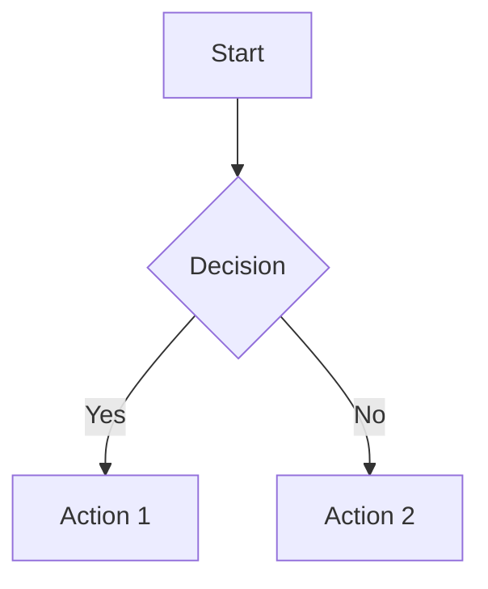
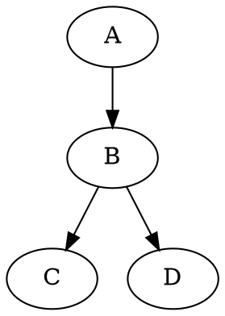

# CLAUDE.md - AI Assistant Guide for markdown-site

This document provides guidance for AI assistants working with this codebase.

## Project Overview

A minimalist static markdown blog built with React, TypeScript, and Vite. Content is stored in markdown files, converted to JSON at build time, and deployed to GitHub Pages.

**Key features:**
- Markdown-based blog posts and static pages
- Static site generation (no backend required)
- SEO optimization (RSS, sitemap, Open Graph)
- GitHub Pages deployment with GitHub Actions
- Rich content support: LaTeX math, Mermaid diagrams, Graphviz/DOT, TikZ, SVG

## Tech Stack

- **Frontend:** React 18, TypeScript, Vite
- **Hosting:** GitHub Pages
- **Styling:** CSS (global.css), no CSS framework
- **Routing:** react-router-dom

## Project Structure

```
markdown-site/
├── content/
│   ├── blog/           # Markdown blog posts
│   └── pages/          # Static pages (about, contact, etc.)
├── public/
│   ├── data/           # Generated JSON files (posts, pages)
│   ├── images/         # Static images
│   ├── rss.xml         # Generated RSS feed
│   ├── rss-full.xml    # Generated RSS with full content
│   ├── sitemap.xml     # Generated sitemap
│   ├── 404.html        # SPA fallback for GitHub Pages
│   ├── robots.txt      # Crawler rules
│   └── llms.txt        # AI agent discovery
├── scripts/
│   └── generate-static.ts  # Markdown to JSON generator
├── src/
│   ├── components/     # React components
│   ├── context/        # React contexts (ThemeContext)
│   ├── pages/          # Page components (Home, Post)
│   └── styles/         # Global CSS
└── .github/
    └── workflows/
        └── deploy.yml  # GitHub Pages deployment
```

## Development Commands

```bash
# Start dev server (generates static data first)
npm run dev

# Build for production
npm run build

# Generate static JSON/RSS/sitemap from markdown
npm run generate

# Type check
npm run typecheck

# Lint
npm run lint

# Preview production build
npm run preview
```

## Key Conventions

### TypeScript

- Strict mode enabled
- Prefix unused parameters with `_`
- Target ES2020

### React Components

- Functional components only
- Use hooks for state and effects
- Fetch data from static JSON files using `fetch()`

### Static Data Loading

Components fetch data from `/data/*.json` files generated at build time:

```typescript
// Example: fetching posts list
useEffect(() => {
  fetch(`${import.meta.env.BASE_URL}data/posts.json`)
    .then((res) => res.json())
    .then((data) => setPosts(data));
}, []);
```

### Base Path

The site deploys to `/blog/` subdirectory on GitHub Pages. Use `import.meta.env.BASE_URL` for all asset and data paths.

## Content Workflow

### Writing Posts

1. Create markdown file in `content/blog/`:

```markdown
---
title: "Post Title"
description: "Brief description"
date: "2025-01-15"
slug: "post-slug"
published: true
tags: ["tag1", "tag2"]
readTime: "5 min read"
image: "/images/og-image.png"  # Optional
---

Your content here...
```

2. Run `npm run build` or `npm run dev` to regenerate static data

### Writing Static Pages

Create in `content/pages/` with frontmatter:

```markdown
---
title: "About"
slug: "about"
published: true
order: 1  # Nav display order
---
```

## Rich Content Features

The site supports advanced markdown content including math, diagrams, and graphics.

### LaTeX Math

Use KaTeX for rendering mathematical equations:

```markdown
Inline math: $E = mc^2$

Block math:
$$
\int_0^\infty e^{-x^2} dx = \frac{\sqrt{\pi}}{2}
$$
```

### Mermaid Diagrams

Create flowcharts, sequence diagrams, and more:

````markdown

````

### Graphviz/DOT Diagrams

Create graph visualizations using DOT language:

````markdown

````

Also accepts `graphviz` as the language identifier.

### TikZ Diagrams

Render LaTeX TikZ graphics (loads tikzjax from CDN):

````markdown
```tikz
\begin{tikzpicture}
    \draw (0,0) circle (1cm);
    \draw (0,0) -- (1,0);
\end{tikzpicture}
```
````

Also accepts `latex-tikz` as the language identifier.

### Inline SVG

Raw SVG is supported via `rehype-raw`:

```markdown
<svg width="100" height="100">
  <circle cx="50" cy="50" r="40" fill="blue" />
</svg>
```

## Generated Files

The `npm run generate` script creates:

| File | Description |
|------|-------------|
| `public/data/posts.json` | List of all posts (metadata only) |
| `public/data/posts/{slug}.json` | Individual post with full content |
| `public/data/pages.json` | List of all pages (metadata only) |
| `public/data/pages/{slug}.json` | Individual page with full content |
| `public/rss.xml` | RSS feed (descriptions only) |
| `public/rss-full.xml` | RSS feed (full content) |
| `public/sitemap.xml` | XML sitemap |

## Static Assets

| Path | Description |
|------|-------------|
| `/blog/rss.xml` | RSS feed |
| `/blog/rss-full.xml` | RSS feed with full content |
| `/blog/sitemap.xml` | XML sitemap |
| `/blog/llms.txt` | AI agent discovery |
| `/blog/robots.txt` | Crawler rules |

## Testing

Manual testing workflow:

1. Run `npm run dev`
2. Open http://localhost:5173/blog/
3. Verify posts display correctly
4. Test navigation between pages
5. Run `npm run typecheck` before committing
6. Run `npm run lint` to check for issues

## Deployment

### GitHub Pages (Automatic)

Push to `main` branch triggers automatic deployment via GitHub Actions.

Setup:
1. Go to repository Settings > Pages
2. Set Source to "GitHub Actions"
3. Push to main branch

### Manual Build

```bash
npm run build
```

Built files will be in `dist/`.

## Common Tasks

### Add a new blog post

1. Create `content/blog/my-post.md` with frontmatter
2. Run `npm run build` or push to main

### Add a new static page

1. Create `content/pages/my-page.md` with frontmatter
2. Run `npm run build` or push to main

### Update site configuration

Edit these files:
- `scripts/generate-static.ts` - `SITE_URL`, `SITE_NAME` constants
- `src/pages/Home.tsx` - `siteConfig` object
- `src/pages/Post.tsx` - `SITE_URL`, `SITE_NAME` constants
- `index.html` - meta tags and JSON-LD

### Change base path

1. Update `base` in `vite.config.ts`
2. Update paths in `index.html`
3. Update `basePath` in `src/main.tsx`
4. Update `public/404.html`

## Files to Never Edit

- `public/data/*` - Generated by build script
- `public/rss.xml` - Generated by build script
- `public/sitemap.xml` - Generated by build script
- `dist/*` - Build output
- `node_modules/*`

## Important Files

- `README.md` - User-facing documentation
- `scripts/generate-static.ts` - Static site generator
- `vite.config.ts` - Vite configuration with base path
- `.github/workflows/deploy.yml` - GitHub Actions deployment
