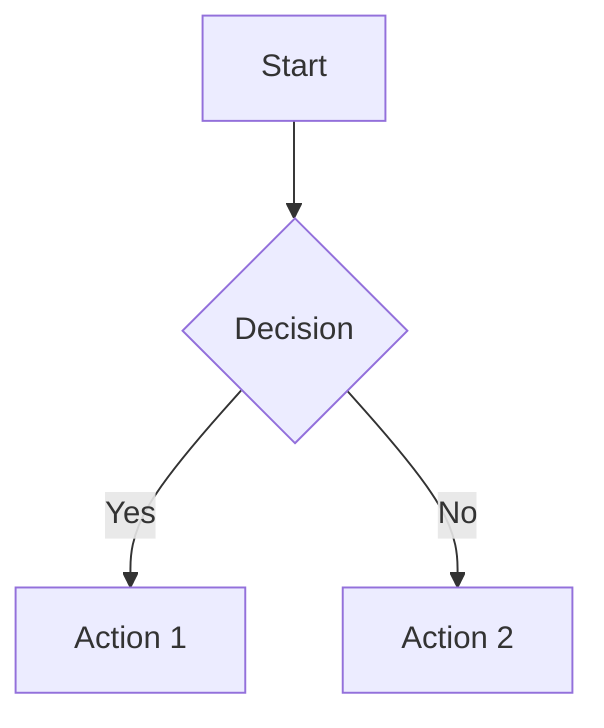
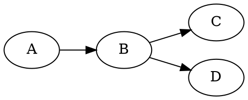

# Static Markdown Blog

A minimalist markdown blog built with React, TypeScript, and Vite. Deployed on GitHub Pages.

## Features

- Markdown-based blog posts with frontmatter
- Syntax highlighting for code blocks
- **Rich content support:**
  - LaTeX math equations (KaTeX)
  - Mermaid diagrams (flowcharts, sequence diagrams, etc.)
  - Graphviz/DOT graph visualizations
  - TikZ diagrams (LaTeX graphics)
  - Inline SVG
- Four theme options: Dark, Light, Tan (default), Cloud
- Fully responsive design
- Static site generation
- RSS feeds
- SEO optimized (sitemap, Open Graph, JSON-LD)

## Getting Started

### Prerequisites

- Node.js 18 or higher

### Setup

1. Install dependencies:

```bash
npm install
```

2. Start the development server:

```bash
npm run dev
```

3. Open http://localhost:5173/blog/

## Writing Blog Posts

Create markdown files in `content/blog/` with frontmatter:

```markdown
---
title: "Your Post Title"
description: "A brief description"
date: "2025-01-15"
slug: "your-post-slug"
published: true
tags: ["tag1", "tag2"]
readTime: "5 min read"
image: "/images/my-header.png"
---

Your markdown content here...
```

## Static Pages

Create optional pages like About, Projects, or Contact in `content/pages/`:

```markdown
---
title: "About"
slug: "about"
published: true
order: 1
---

Your page content here...
```

Pages appear as navigation links. The `order` field controls display order (lower numbers first).

## Images

### Open Graph Images

Add an `image` field to frontmatter for social media previews:

```yaml
image: "/images/my-header.png"
```

Recommended dimensions: 1200x630 pixels.

### Inline Images

Add images in markdown content:

```markdown

```

Place image files in `public/images/`.

### Site Logo

Edit `src/pages/Home.tsx` to set your site logo:

```typescript
const siteConfig = {
  logo: "/images/logo.svg", // Set to null to hide
  // ...
};
```

### Favicon

Replace `public/favicon.svg` with your own icon.

## Rich Content

### LaTeX Math

Write mathematical equations using KaTeX syntax:

```markdown
Inline math: $E = mc^2$

Block math:
$$
\int_0^\infty e^{-x^2} dx = \frac{\sqrt{\pi}}{2}
$$
```

### Mermaid Diagrams

Create flowcharts, sequence diagrams, state diagrams, and more:

````markdown

````

### Graphviz/DOT

Create graph visualizations using DOT language:

````markdown

````

Also supports `graphviz` as the language identifier.

### TikZ Diagrams

Render LaTeX TikZ graphics (loaded from tikzjax CDN):

````markdown
```tikz
\begin{tikzpicture}
    \draw[->] (0,0) -- (2,0) node[right] {$x$};
    \draw[->] (0,0) -- (0,2) node[above] {$y$};
    \draw (0,0) circle (1cm);
\end{tikzpicture}
```
````

Also supports `latex-tikz` as the language identifier.

### Inline SVG

Embed SVG graphics directly in markdown:

```markdown
<svg width="100" height="100" viewBox="0 0 100 100">
  <circle cx="50" cy="50" r="40" fill="currentColor" opacity="0.5" />
</svg>
```

## Development Commands

| Command | Description |
|---------|-------------|
| `npm run dev` | Start dev server with hot reload |
| `npm run build` | Build for production |
| `npm run preview` | Preview production build |
| `npm run generate` | Generate static JSON from markdown |
| `npm run typecheck` | Run TypeScript type checking |
| `npm run lint` | Run ESLint |

## Project Structure

```
markdown-site/
├── content/
│   ├── blog/           # Markdown blog posts
│   └── pages/          # Static pages (about, contact, etc.)
├── public/
│   ├── data/           # Generated JSON (created by build)
│   ├── images/         # Static images
│   ├── rss.xml         # Generated RSS feed
│   ├── sitemap.xml     # Generated sitemap
│   └── 404.html        # SPA fallback for GitHub Pages
├── scripts/
│   └── generate-static.ts  # Markdown to JSON generator
├── src/
│   ├── components/     # React components
│   ├── context/        # Theme context
│   ├── pages/          # Page components
│   └── styles/         # Global CSS
└── .github/
    └── workflows/
        └── deploy.yml  # GitHub Pages deployment
```

## Deployment

### GitHub Pages (Automatic)

Push to the `main` branch triggers automatic deployment via GitHub Actions.

To set up:
1. Go to your repository Settings > Pages
2. Set Source to "GitHub Actions"
3. Push to main branch

### Manual Build

```bash
npm run build
```

The built files will be in `dist/`.

## Configuration

### Site URL

Update the site URL in these files:
- `scripts/generate-static.ts` - `SITE_URL` constant
- `src/pages/Home.tsx` - `siteConfig` object
- `src/pages/Post.tsx` - `SITE_URL` constant
- `index.html` - meta tags and JSON-LD

### Base Path

The site is configured to deploy at `/blog/`. To change this:
1. Update `base` in `vite.config.ts`
2. Update paths in `index.html`
3. Update `basePath` in `src/main.tsx`

## RSS Feeds

- `/blog/rss.xml` - Post descriptions only
- `/blog/rss-full.xml` - Full post content

## Theme Configuration

The default theme is Tan. Users can cycle through themes using the toggle:

- Dark (Moon icon)
- Light (Sun icon)
- Tan (Half icon) - default
- Cloud (Cloud icon)

To change the default theme, edit `src/context/ThemeContext.tsx`:

```typescript
const DEFAULT_THEME: Theme = "tan"; // Change to "dark", "light", or "cloud"
```

## Tech Stack

- React 18
- TypeScript
- Vite
- react-markdown with remark/rehype plugins
- react-syntax-highlighter
- KaTeX (math rendering)
- Mermaid (diagrams)
- @viz-js/viz (Graphviz)
- date-fns
- lucide-react

## License

MIT
