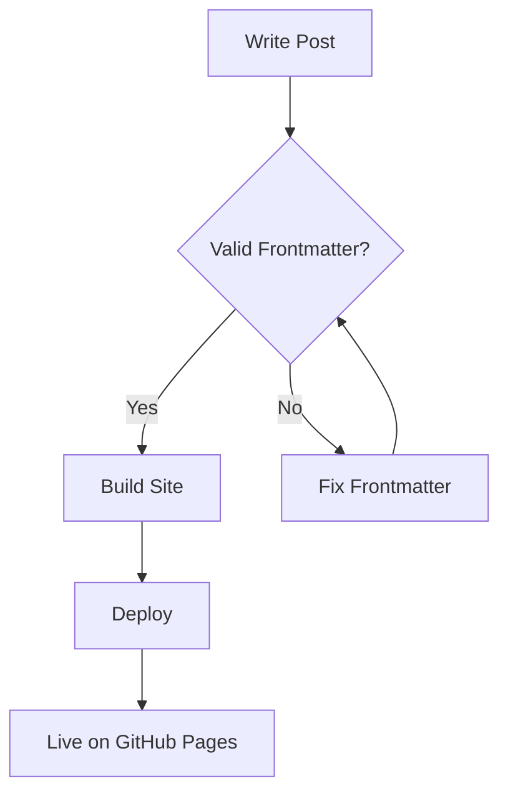
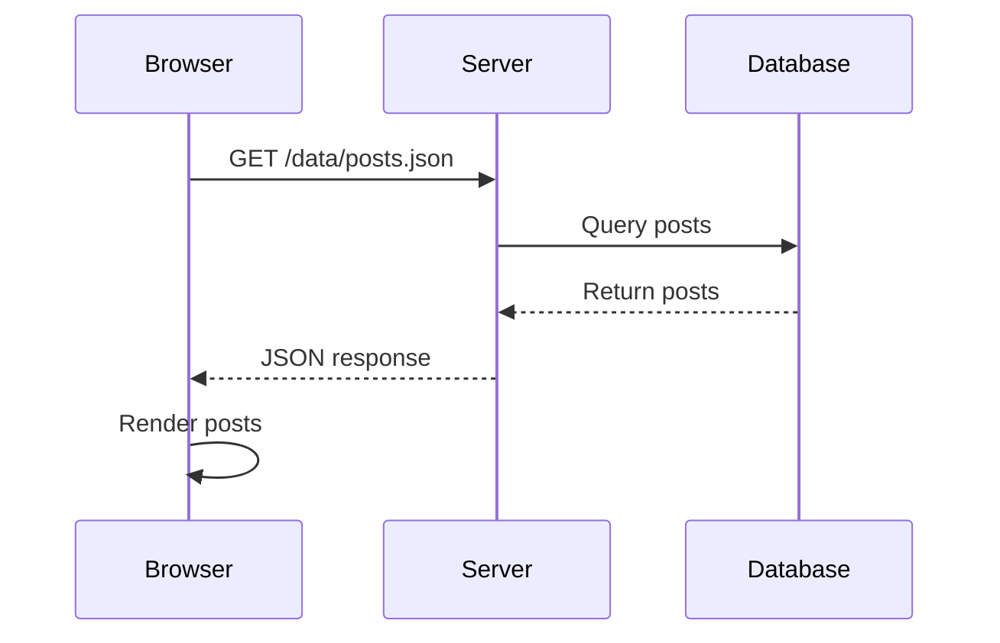
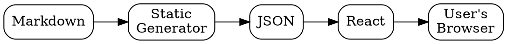

# Writing Markdown with Code Examples

This post demonstrates how to write markdown content with code blocks, tables, and formatting. Use it as a reference when creating your own posts.

## Frontmatter

Every post starts with frontmatter between `---` delimiters:

```yaml
---
title: "Your Post Title"
description: "A brief description for SEO"
date: "2025-01-17"
slug: "your-url-slug"
published: true
tags: ["tag1", "tag2"]
readTime: "5 min read"
---
```

## Code Blocks

### TypeScript

```typescript
interface Post {
  slug: string;
  title: string;
  description: string;
  content: string;
  date: string;
  tags: string[];
}

async function fetchPosts(): Promise<Post[]> {
  const response = await fetch("/data/posts.json");
  return response.json();
}
```

### React Component

```tsx
import { useState, useEffect } from "react";

interface Post {
  slug: string;
  title: string;
}

export function PostList() {
  const [posts, setPosts] = useState<Post[]>([]);

  useEffect(() => {
    fetch("/data/posts.json")
      .then((res) => res.json())
      .then((data) => setPosts(data));
  }, []);

  return (
    <ul>
      {posts.map((post) => (
        <li key={post.slug}>
          <a href={`/${post.slug}`}>{post.title}</a>
        </li>
      ))}
    </ul>
  );
}
```

### Bash Commands

```bash
# Install dependencies
npm install

# Start development server
npm run dev

# Build for production
npm run build

# Preview production build
npm run preview
```

### JSON

```json
{
  "name": "markdown-blog",
  "version": "1.0.0",
  "scripts": {
    "dev": "npm run generate && vite",
    "build": "npm run generate && vite build",
    "generate": "npx tsx scripts/generate-static.ts"
  }
}
```

## Inline Code

Use backticks for inline code like `npm install` or `useState`.

Reference files with inline code: `scripts/generate-static.ts`, `src/pages/Home.tsx`.

## Tables

| Command           | Description                |
| ----------------- | -------------------------- |
| `npm run dev`     | Start development server   |
| `npm run build`   | Build for production       |
| `npm run generate`| Generate static JSON       |
| `npm run preview` | Preview production build   |

## Lists

### Unordered

- Write posts in markdown
- Build generates static JSON
- Deploy to GitHub Pages
- Updates deploy automatically

### Ordered

1. Fork the repository
2. Customize your site
3. Write your posts
4. Push to deploy

## Blockquotes

> Markdown files in your repo are simpler than a CMS. Version controlled, AI-editable, and no separate admin panel.

## Links

External links: [GitHub Pages Docs](https://docs.github.com/en/pages)

Internal links: [Setup Guide](/setup-guide)

## Emphasis

Use **bold** for strong emphasis and _italics_ for lighter emphasis.

## Horizontal Rule

---

## Math Equations

Write mathematical equations using LaTeX syntax with KaTeX rendering.

### Inline Math

The famous equation $E = mc^2$ changed physics forever. The quadratic formula is $x = \frac{-b \pm \sqrt{b^2-4ac}}{2a}$.

### Block Math

The Gaussian integral:

$$
\int_{-\infty}^{\infty} e^{-x^2} dx = \sqrt{\pi}
$$

A matrix example:

$$
\begin{pmatrix}
a & b \\
c & d
\end{pmatrix}
\begin{pmatrix}
x \\
y
\end{pmatrix}
=
\begin{pmatrix}
ax + by \\
cx + dy
\end{pmatrix}
$$

## Mermaid Diagrams

Create diagrams using Mermaid syntax.

### Flowchart



### Sequence Diagram



## Graphviz/DOT Diagrams

Create graph visualizations using DOT language.



## TikZ Diagrams

Render LaTeX TikZ graphics for precise technical illustrations.

```tikz
\begin{tikzpicture}[scale=1.5]
    \draw[->] (-0.5,0) -- (3,0) node[right] {$x$};
    \draw[->] (0,-0.5) -- (0,2) node[above] {$y$};
    \draw[domain=0:2.5, smooth, variable=\x, blue, thick]
        plot ({\x}, {0.5*\x*\x}) node[right] {$y = \frac{x^2}{2}$};
    \fill[red] (1,0.5) circle (2pt);
    \draw[dashed] (1,0) -- (1,0.5) -- (0,0.5);
    \node[below] at (1,0) {$1$};
    \node[left] at (0,0.5) {$\frac{1}{2}$};
\end{tikzpicture}
```

## Inline SVG

Embed SVG graphics directly in your markdown:

<svg width="200" height="100" viewBox="0 0 200 100">
  <rect x="10" y="10" width="80" height="80" rx="10" fill="#4A90A4" opacity="0.8"/>
  <rect x="110" y="10" width="80" height="80" rx="10" fill="#7B68EE" opacity="0.8"/>
  <text x="50" y="55" text-anchor="middle" fill="white" font-size="12">Static</text>
  <text x="150" y="55" text-anchor="middle" fill="white" font-size="12">Simple</text>
</svg>

## Images

Place images in `public/images/` and reference them:

```markdown

```

## File Structure Reference

```
content/blog/
├── about-this-blog.md
├── markdown-with-code-examples.md
├── setup-guide.md
└── your-new-post.md
```

## Tips

1. Keep slugs URL-friendly (lowercase, hyphens)
2. Set `published: false` for drafts
3. Run `npm run build` after adding posts
4. Use descriptive titles for SEO
5. Use `$...$` for inline math and `$$...$$` for block math
6. Mermaid supports many diagram types - see [mermaid.js.org](https://mermaid.js.org/)
7. For complex TikZ, test your code in a LaTeX editor first
8. SVG graphics respect theme colors when using `currentColor`
